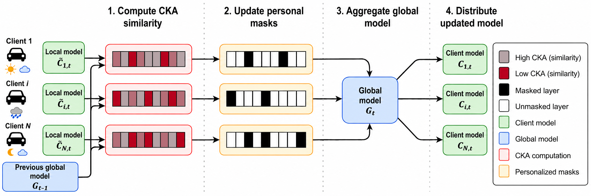
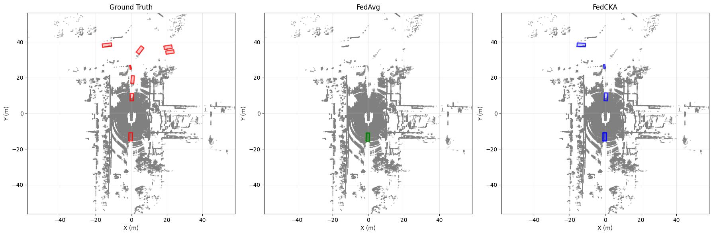

# FedCKA: Representation-Guided Layer Personalization for Federated 3D Perception
[📄 Paper (arXiv)](https://arxiv.org/abs/2610.01510)

Code accompanying **FedCKA: Representation-Guided Layer Personalization for Federated 3D Perception Across Driving Domains**.

## Overview

**FedCKA** is a personalized federated learning method for 3D object detection under heterogeneous driving domains. It uses Centered Kernel Alignment (CKA) to measure layer-wise representation similarity, creating dynamic client-specific aggregation masks that determine which layers remain globally shared and which are locally personalized.

<p align="center">
  
</p>

<p align="center">
  <em>FedCKA dynamically identifies client-specific layers through representation similarity. After local training, layer-wise CKA scores determine which layers remain personalized and which are shared through global aggregation.</em>
</p>

## Repository Structure

```text
.
├── mmdet/                              # Main project directory
│   ├── image/                          # Apptainer definition file and container setup
│   │   └── README.md                   # Container build and verification instructions
│   └── mmdetection3d/                  # Core framework and project workspace
│       ├── mmdet3d/                    # Customized mmdet3d runner
│       ├── projects/                   # All experiments and configurations
│       │   ├── analysis/               # Evaluation, class balance, and qualitative results
│       │   ├── cmt_40_epoch/           # Main federated experiments and model merging tools
│       │   ├── cmt_full/               # Full CMT baseline replication
│       │   ├── mmdet3d_plugin/         # Custom FP16 CMT plugin for small batch sizes
│       │   ├── subsets_creation/       # nuScenes split generation and .pkl metadata files
│       │   └── README.md               # Projects guide, path configurations, and setups
│       ├── tools/                      # Adjusted train and evaluation scripts
│       └── README.md                   # Base MMDetection3D clone and checkpoint setup
└── README.md                           # Main project overview, NDS results, and citations

```

## Results (NDS)

Comparison of Federated Learning methods across nuScenes domains. Performance is reported as **nuScenes Detection Score (NDS)**.

| Method | Domain A | Domain B | Domain C | Domain D | Domain E | Avg. |
| --- | --- | --- | --- | --- | --- | --- |
| *Centralized* | *0.66* | *0.68* | *0.67* | *0.64* | *0.58* | *0.66* |
| *Own Domain Only* | *0.64* | *0.51* | *0.62* | *0.24* | *0.08* | *0.57* |
| FedAvg [1] | 0.37 | 0.36 | 0.38 | 0.35 | 0.33 | 0.37 |
| FedDyn [2] | 0.48 | 0.46 | 0.48 | 0.43 | 0.35 | 0.47 |
| PCGrad [3] | 0.41 | 0.41 | 0.44 | 0.39 | 0.34 | 0.42 |
| FedRep [4] | 0.43 | 0.40 | 0.44 | 0.41 | 0.33 | 0.43 |
| FedBN [5] | 0.41 | 0.41 | 0.43 | 0.36 | 0.33 | 0.41 |
| FedMC [6] | 0.56 | 0.56 | 0.58 | 0.47 | 0.32 | 0.56 |
| FedSelect [7] | 0.59 | 0.51 | 0.56 | 0.40 | 0.34 | 0.55 |
| **FedCKA (Ours)** | **0.65** | **0.63** | **0.64** | **0.59** | **0.50** | **0.63** |

### Qualitative Results

FedCKA particularly benefits challenging domains with strong distribution shifts. The example below shows predictions on the **Singapore night-rain** domain, comparing Ground Truth, FedAvg, and FedCKA.

<p align="center">
  
</p>

<p align="center">
  <em>Qualitative comparison under severe domain shift. FedCKA recovers detections missed by the standard FedAvg baseline.</em>
</p>


## Download Dependencies & Checkpoints (Hugging Face)

The required `.sif` container, Flash Attention wheel, and pretrained checkpoints are hosted on Hugging Face. 

### 1. Container & Wheel Files
Download the image components directly into the `/image` directory:

```bash
cd /YOUR_PATH_HERE/mmdet/image
wget -c [https://huggingface.co/datasets/Anon-fedcka-ICRA/essentials/resolve/main/unibev_cuda113_ubuntu2004_gcc10.sif](https://huggingface.co/datasets/Anon-fedcka-ICRA/essentials/resolve/main/unibev_cuda113_ubuntu2004_gcc10.sif)
wget -c [https://huggingface.co/datasets/Anon-fedcka-ICRA/essentials/resolve/main/flash_attn-0.2.2+cu113torch1.11.0-cp38-cp38-linux_x86_64.whl](https://huggingface.co/datasets/Anon-fedcka-ICRA/essentials/resolve/main/flash_attn-0.2.2+cu113torch1.11.0-cp38-cp38-linux_x86_64.whl)

```

### 2. Pretrained Checkpoints

Create the checkpoints directory and download the required `.pth` weights into it:

```bash
mkdir -p /YOUR_PATH_HERE/mmdet/mmdetection3d/ckpts
cd /YOUR_PATH_HERE/mmdet/mmdetection3d/ckpts
wget -c [https://huggingface.co/datasets/Anon-fedcka-ICRA/essentials/resolve/main/nuim_r50.pth](https://huggingface.co/datasets/Anon-fedcka-ICRA/essentials/resolve/main/nuim_r50.pth)
wget -c [https://huggingface.co/datasets/Anon-fedcka-ICRA/essentials/resolve/main/fcos3d_vovnet_imgbackbone-remapped.pth](https://huggingface.co/datasets/Anon-fedcka-ICRA/essentials/resolve/main/fcos3d_vovnet_imgbackbone-remapped.pth)

```

## Paper & Citation

Paper: [FedCKA: Representation-Guided Layer Personalization for Federated 3D Perception Across Driving Domains](https://arxiv.org/abs/2610.01510)

If you use this work, please cite:

```bibtex
@misc{verhoog2026fedcka,
  title={{FedCKA}: Representation-Guided Layer Personalization for Federated {3D} Perception Across Driving Domains},
  author={Verhoog, Jolle and Ünal, Ali Burak and Caesar, Holger},
  year={2026},
  eprint={2610.01510},
  archivePrefix={arXiv},
  primaryClass={cs.CV},
  url={https://arxiv.org/abs/2610.01510}
}
```

## AI Usage Disclosure

During the development of this codebase, the authors utilized ChatGPT, Google Gemini, and GitHub Copilot in Agent Mode as programming assistants. The system was used strictly as an assistive tool for debugging, expanding existing functions, generating boilerplate code, and replacing repetitive tasks. All AI-generated code was thoroughly reviewed, tested, and modified by the authors to ensure correctness and compatibility within the MMDetection3D environment. The authors assume full responsibility for the functionality, logic, and integrity of the code in this repository.

### References

* [1] B. McMahan, E. Moore, D. Ramage, S. Hampson, and B. A. y. Arcas, "Communication efficient learning of deep networks from decentralized data," in *Proc. AISTATS*, 2017, pp. 1273–1282.
* [2] D. A. E. Acar, Y. Zhao, R. Matas Navarro, M. Mattina, P. N. Whatmough, and V. Saligrama, "Federated learning based on dynamic regularization," in *Proc. ICLR*, 2021.
* [3] T. Yu, S. Kumar, A. Gupta, S. Levine, K. Hausman, and C. Finn, "Gradient surgery for multi-task learning," in *Proc. NeurIPS*, 2020, pp. 5824–5836; and X. Zhang, W. Sun, and Y. Chen, "Tackling the non-IID issue in heterogeneous federated learning by gradient harmonization," *IEEE Signal Processing Letters*, vol. 31, pp. 2595–2599, 2024.
* [4] L. Collins, H. Hassani, A. Mokhtari, and S. Shakkottai, "Exploiting shared representations for personalized federated learning," in *Proc. ICML*, 2021, pp. 2089–2099.
* [5] X. Li, M. Jiang, X. Zhang, M. Kamp, and Q. Dou, "FedBN: Federated learning on non-IID features via local batch normalization," in *Proc. ICLR*, 2021.
* [6] Y. Gao, X. He, and Y. Chen, "Personalized federated learning algorithm based on information content model customization," in *Proc. CAMMIC*, 2025, pp. 834–838.
* [7] R. Tamirisa, C. Xie, W. Bao, A. Zhou, R. Arel, and A. Shamsian, "FedSelect: Personalized federated learning with customized selection of parameters for fine-tuning," in *Proc. CVPR*, 2024, pp. 29485–29494.
* [8] MMDetection3D Contributors, "MMDetection3D: OpenMMLab next-generation platform for general 3D object detection," 2020. [Online]. Available: https://github.com/open-mmlab/mmdetection3d
* [9] J. Yan et al., "Cross modal transformer: Towards fast and robust 3D object detection," in *Proc. ICCV*, 2023, pp. 18268–18278.

## License and Third-Party Notices

Original FedCKA contributions are licensed under the **Apache License, Version 2.0**; see [LICENSE](LICENSE). Third-party code retains its applicable licenses and copyright notices. The FedCKA license does not replace those terms.

This repository builds upon [MMDetection3D](https://github.com/open-mmlab/mmdetection3d) and [CMT](https://github.com/junjie18/CMT). Both projects are distributed under Apache-2.0. Their retained code includes contributions originating from other projects, including DETR3D and UVTR.

### Upstream Attribution

| Component | Attribution | License / notice |
| --- | --- | --- |
| [MMDetection3D](https://github.com/open-mmlab/mmdetection3d) and inherited OpenMMLab code | Copyright 2018-2019 Open-MMLab. All rights reserved. Additional OpenMMLab notices are retained in the source files. | Apache-2.0; [MMDetection3D license](https://github.com/open-mmlab/mmdetection3d/blob/v1.0.0rc5/LICENSE). |
| [CMT](https://github.com/junjie18/CMT) | Copyright (c) 2023 Megvii Inc. All rights reserved. Additional megvii-model notices are retained in the source files. | Apache-2.0; [CMT license](https://github.com/junjie18/CMT/blob/master/LICENSE). |
| [DETR3D](https://github.com/WangYueFt/detr3d), inherited through CMT | Copyright (c) 2021 Wang, Yue. | MIT; full license reproduced below. |
| [UVTR](https://github.com/JIA-Lab-research/UVTR), inherited through CMT's ground-truth database creation code | Copyright (c) 2022 Li, Yanwei. | Apache-2.0; retain the attribution in `tools/data_converter/create_gt_database.py`. |
| VoVNet code inherited through CMT | Copyright (c) Youngwan Lee (ETRI) All Rights Reserved. Copyright 2021 Toyota Research Institute. All rights reserved. | These additional notices are retained in `projects/mmdet3d_plugin/models/backbones/vovnet.py`, alongside its CMT and DETR3D attributions. |

Paths in the table are relative to `mmdet/mmdetection3d/`. Existing source-file notices remain applicable. When redistributing this code, preserve the applicable copyright, attribution, and license notices, including those reproduced here. Modified upstream files must carry a notice identifying their modification for FedCKA.

### MIT License — DETR3D-Derived Code

The following license applies to retained DETR3D-derived portions:

```text
MIT License

Copyright (c) 2021 Wang, Yue

Permission is hereby granted, free of charge, to any person obtaining a copy
of this software and associated documentation files (the "Software"), to deal
in the Software without restriction, including without limitation the rights
to use, copy, modify, merge, publish, distribute, sublicense, and/or sell
copies of the Software, and to permit persons to whom the Software is
furnished to do so, subject to the following conditions:

The above copyright notice and this permission notice shall be included in all
copies or substantial portions of the Software.

THE SOFTWARE IS PROVIDED "AS IS", WITHOUT WARRANTY OF ANY KIND, EXPRESS OR
IMPLIED, INCLUDING BUT NOT LIMITED TO THE WARRANTIES OF MERCHANTABILITY,
FITNESS FOR A PARTICULAR PURPOSE AND NONINFRINGEMENT. IN NO EVENT SHALL THE
AUTHORS OR COPYRIGHT HOLDERS BE LIABLE FOR ANY CLAIM, DAMAGES OR OTHER
LIABILITY, WHETHER IN AN ACTION OF CONTRACT, TORT OR OTHERWISE, ARISING FROM,
OUT OF OR IN CONNECTION WITH THE SOFTWARE OR THE USE OR OTHER DEALINGS IN THE
SOFTWARE.
```

### Datasets, Checkpoints, and Binary Dependencies

The Apache-2.0 license for FedCKA does not grant additional rights to nuScenes data, pretrained checkpoints, container images, or third-party binary dependencies linked from this repository. Those materials remain subject to their respective licenses and terms. Obtain and use nuScenes through its [official website](https://www.nuscenes.org/).
